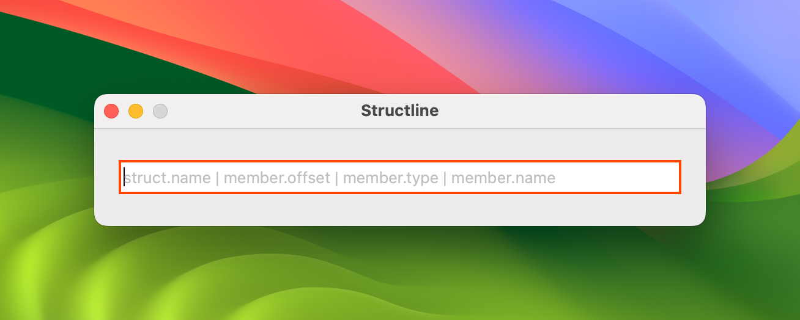
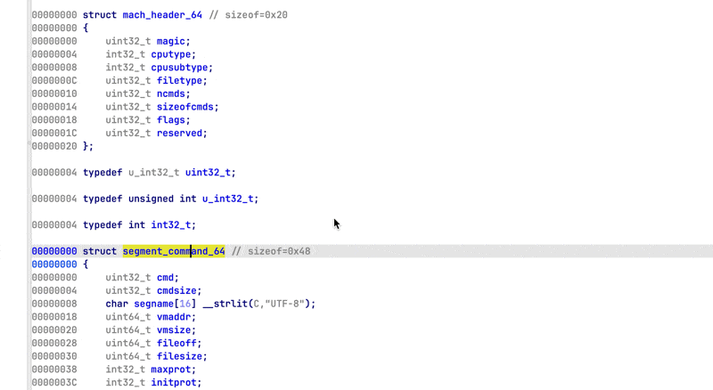
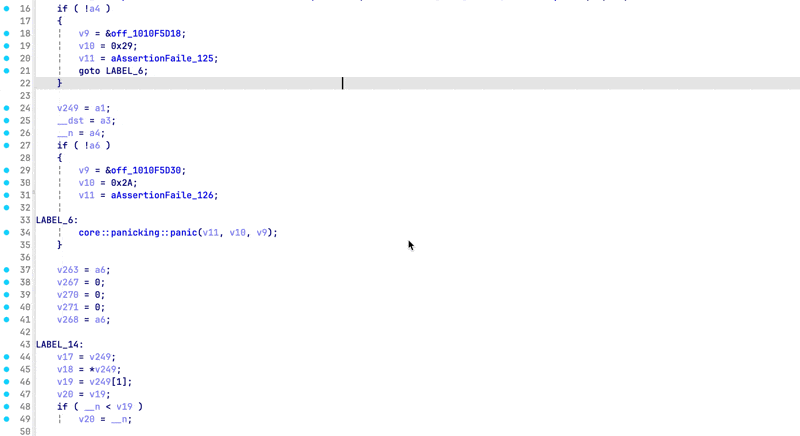
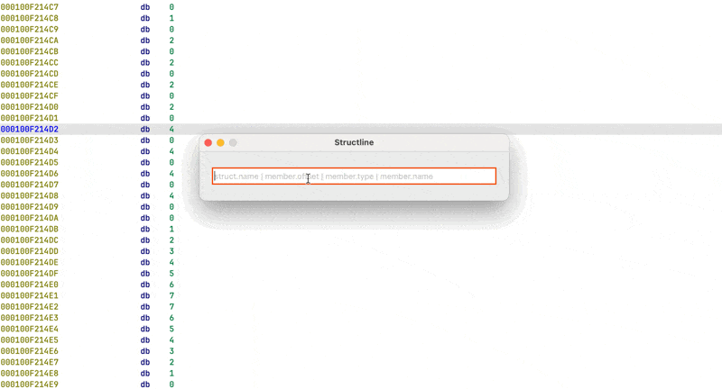
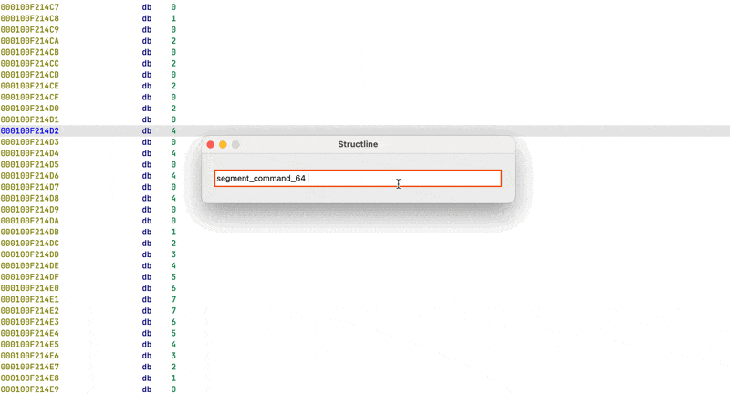
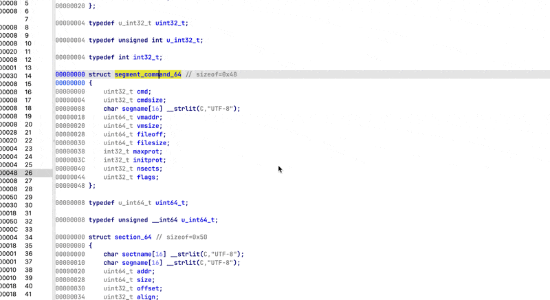
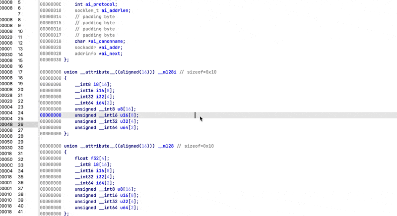

# Structline

CLI-like IDA plugin for lightning-fast struct member definition.

## The Problem

IDA does keyboard navigation very well, but struct workflows still involve too many steps. The typical flow:

1. Open/switch to Local Types window
2. Create new type or find existing one
3. Set struct size
4. Press `G` to navigate to offset
5. Define member type and name
6. Close/switch windows

## The Solution

**Structline collapses this into a single text input.**

Press `F` and type `MyStruct 10 int count`

Done. You've just added `int` named `count` at offset `0x10` for struct `MyStruct`.

**For the second member**, it gets even faster:

1. Highlight the offset in disassembly/decompiler (e.g., `0x18` or `18` (equivalent))
2. Press `F`
3. Input pre-fills: `MyStruct 18` 
4. Type the rest: `QWORD ptr` (optional)

**Structline** remembers your _last struct_, so adding multiple members becomes: highlight offset → `F` → type → Enter. Repeat.

Want to get rid of _last struct_ ? Delete it from input box and close the window. You don't need to commit a change to get rid of it.

## Core Features

### Smart Auto-fill
- **Struct name detection**: Auto-fills from decompiler lvar or highlighted text
- **Last struct memory**: Remembers your most recent struct for rapid multi-member editing (delete it from the input box remove it)
- **Offset parsing**: Grabs hex values under cursor when _last struct_ is set

#### Preview

> getting type from highlight token

> getting type from lvar

- - -

### Input

- **Auto-completion**: Tab-complete struct names and all IDB types
- **History**: Per database history of previous commits. Cycle with up/down arrow
- **Smart defaults**: Omit member type → `_BYTE`, omit member name → `field_X`

#### Preview

> autocompletion

> history (up/down arrow)

- - -

### Collision Handling

- **Overlap preview**: Tooltip shows which members will be overwritten before you commit
- **Auto-deletion**: Removes overlapped members automatically
- **Name suffixing**: Appends IDA-like `_1`, `_2` suffix if member name exists
- **Undo support**: Made mistake ? Use IDA in undo shortcut

#### Preview

> collisions

- - -

### Struct Management

- **Instant struct creation**: Define new structs on the fly (blue border)
- **Auto-expand**: Structures grow automatically to fit new members
- **Type validation**: Real-time feedback on type correctness

#### Preview

> creating structs

- - -

## Visual Feedback

Color coded border indicates input status:

- **🟢 Green**: Valid
- **🟡 Yellow**: Valid, will overwrite members
- **🔵 Blue**: Valid, will create new struct
- **🔴 Red**: Invalid

## Usage

Press **F** and enter space-separated tokens:

	struct_name offset [type] [name]

**Examples:**

	MyStruct 0x10 int* some_size
	MyStruct 20 DWORD[4] my_array → (0x20)
	NewStruct 0 _QWORD* vft_ptr

**Minimal input:**

	MyStruct 8              →  MyStruct 8 _BYTE field_8
	MyStruct 0x10 QWORD[4]  →  MyStruct 0x10 QWORD[4] field_10

### Keyboard Shortcuts

- **Enter**: Commit change
- **Escape**: Close window
- **Tab**: Accept auto-completion
- **Up/Down**: Navigate history
